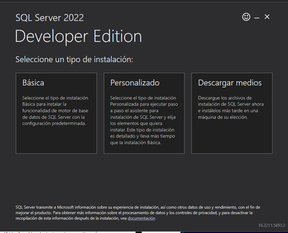
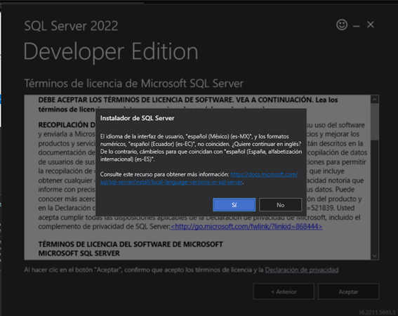
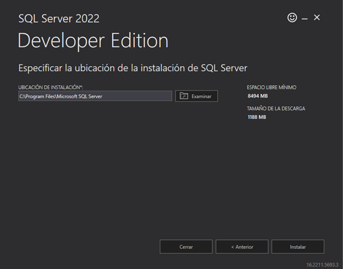
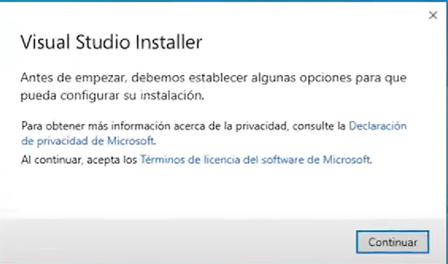
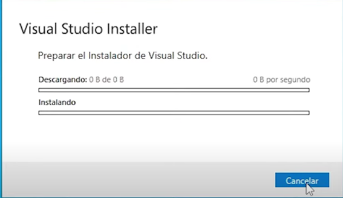
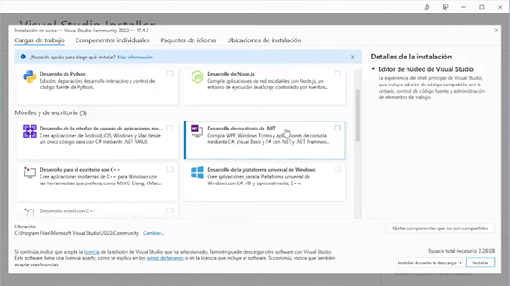
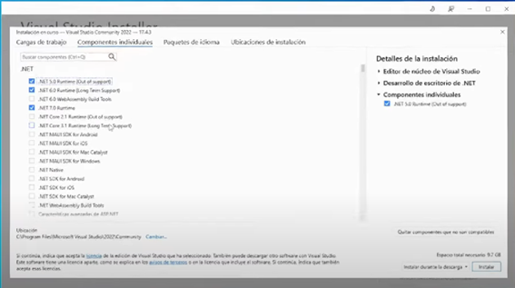
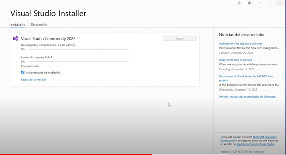

# Presentacion
# Guía de Instalación: SQL Server y Visual Studio:
## Instalación de SQL Server

Sigue estos pasos para instalar SQL Server en tu sistema:

1. **Descargar el instalador de SQL Server**:

   - Accede a la página oficial de [Descargas de SQL Server](https://www.microsoft.com/en-us/sql-server/sql-server-downloads).
   - Haz clic en "Descargar ahora" bajo la opción **Developer**.

3. **Ejecutar el instalador**:
   - Una vez descargado, abre el instalador.
   - Selecciona la opción "Instalación básica".
   - 

4. **Aceptar los términos**:
   - Haz clic en "Sí" y luego en "Aceptar" para continuar.
   - 

5. **Iniciar la instalación**:
   - Presiona "Instalar" y espera a que finalice el proceso.
   - 

6. **Instalar SQL Server Management Studio (SSMS)**:
   - En la ventana de instalación, selecciona "Instalar SSMS".
   - 
   - Descarga SSMS desde el enlace proporcionado y ejecuta el instalador.
   - Haz clic en "Instalar" y espera a que finalice.

7. **Finalizar e iniciar**:
   - Al completar la instalación, presiona "Cerrar".
   - Abre SQL Server Management Studio y presiona "Connect" en la ventana inicial para conectarte al servidor.

---

## Instalación de Visual Studio

Sigue estos pasos para instalar Visual Studio:

1. **Descargar el instalador**:
   - Visita el sitio oficial de [Visual Studio](https://visualstudio.microsoft.com/downloads/).
   - Selecciona la opción "Descarga gratuita" bajo la versión Community.

2. **Ejecutar el instalador**:
   - Abre el archivo descargado y presiona "Continuar".
   - 

3. **Seleccionar configuración**:
   - Marca la opción "Desarrollo de escritorio .NET".
   - 
   - En los componentes individuales, selecciona ".NET 6.0 Runtime".
   - 
   - Haz clic en "Instalar" para iniciar el proceso.

4. **Esperar a que termine**:
   - Permite que el instalador complete la instalación.
   - 

5. **Configuración final**:
   - Una vez instalado, selecciona un tema y presiona "Iniciar Visual Studio".
   - 
   - ¡Visual Studio estará listo para usarse!

---

## Notas Adicionales

- Asegúrate de contar con una conexión a internet estable durante las descargas.
- Revisa los requisitos del sistema antes de iniciar las instalaciones.
- Si tienes algún problema durante el proceso, consulta la documentación oficial o busca soporte en los foros de la comunidad.

---

¡Listo! Ahora tienes SQL Server y Visual Studio configurados en tu máquina.
                                                                                                                                        
